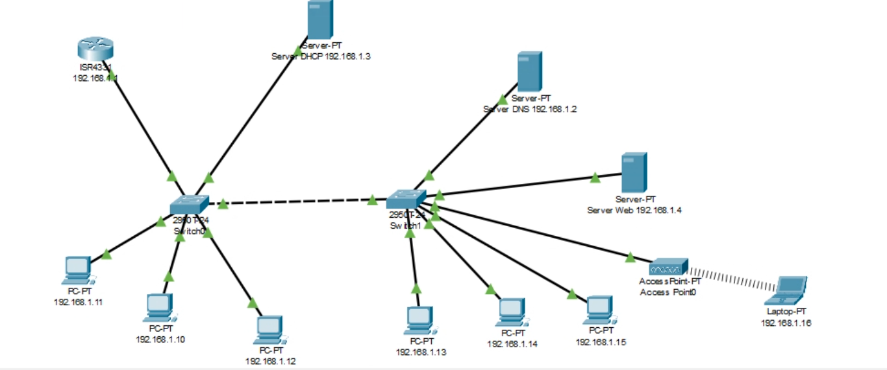

#Simulación de Infraestructura de Red Corporativa

Este proyecto consiste en el diseño, implementación y configuración de una red corporativa simulada utilizando Cisco Packet Tracer. 
El objetivo fue crear una topología funcional que integra servicios de red esenciales, conectividad LAN/WAN y resolución de problemas de enrutamiento, simulando un entorno empresarial real.

## 📸 Topología de Red

## Características Implementadas

### 1. Diseño y Configuración de Red
* **Diseño de Topología Híbrida:** Interconexión de dispositivos finales mediante cableado estructurado y enlaces inalámbricos.
* **Hardware Cisco:** Configuración de Routers y Switches.
* **Segmentación:** Implementación de múltiples redes asegurando la escalabilidad y organización del tráfico.

### 2. Servicios de Red (Server-Side)
* **DHCP Server:** Configuración de pools de direcciones para la asignación dinámica de IPs a los hosts, automatizando la gestión de direcciones.
* **DNS Server:** Implementación de resolución de nombres de dominio para simular navegación web interna/externa (ej. `uces.com`).
* **Web Server:** Despliegue de un servidor HTTP funcional para pruebas de conectividad de capa de aplicación.

### 3. Conectividad y Enrutamiento
* **Routing Estático:** Configuración de rutas estáticas para permitir la comunicación entre distintas subredes y sedes simuladas.
* **WAN:** Simulación de enlaces seriales para conexión de larga distancia.
* **Wireless:** Configuración de Access Point para conectividad de dispositivos móviles (Laptops/Tablets).

## Diagnóstico y Pruebas de Funcionamiento

A continuación se presenta evidencia técnica de la configuración y operatividad de la red:

### 1. Configuración de Enrutamiento (CLI)
Verificación de interfaces activas y tabla de enrutamiento en el Router principal mediante comandos IOS (`show ip interface brief`, `show ip route`). Se puede ver la correcta configuración de Gateways.

### 2. Conectividad Inter-Switch
Prueba de conectividad exitosa (Ping) entre equipos conectados a diferentes switches, validando la comunicación entre ambos switches.

### 3. Servicios DNS y Web
Prueba funcional de capa de aplicación: El cliente accede al servidor web mediante el dominio personalizado `uces.com`, demostrando la correcta configuración del servidor DNS y la respuesta del servicio HTTP.

**Autor:** Thiago Poletti
[LinkedIn](https://www.linkedin.com/in/thiago-poletti/) | [GitHub](https://github.com/ThiagoTJP)
